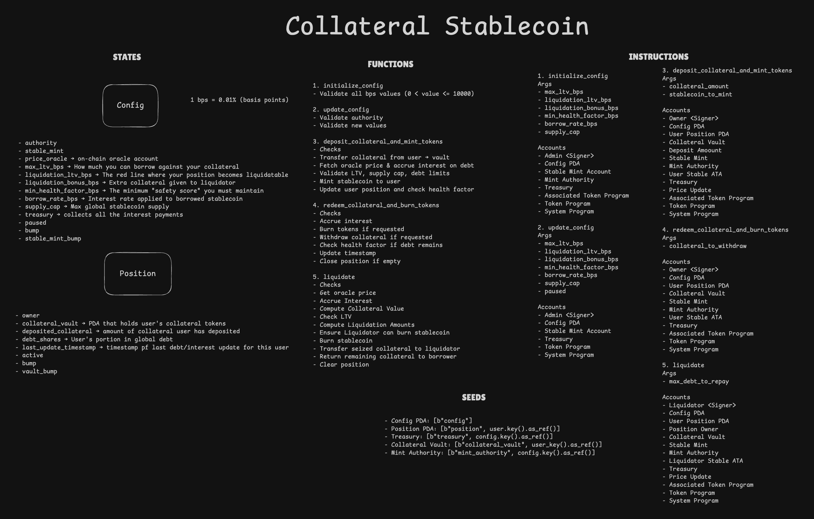

# Collateral-Backed Stablecoin Protocol

A decentralized lending protocol on Solana that enables users to deposit SOL as collateral and mint overcollateralized stablecoins. Built with Anchor framework and secured by Pyth Network oracle price feeds.

## Architecture



## Formulae


## Overview

This protocol implements a CDP (Collateralized Debt Position) system where users can:
- Deposit SOL as collateral
- Mint stablecoins (SUSD) against their collateral
- Manage their positions by adjusting collateral or debt
- Face liquidation if their position becomes undercollateralized

### Key Features

- **Overcollateralized Lending**: Requires collateral value to exceed borrowed value
- **Real-time Oracle Pricing**: Powered by Pyth Network for accurate SOL/USD prices
- **Dynamic Interest Accrual**: Continuous debt accumulation based on configurable rates
- **Automated Liquidations**: Incentivized liquidation mechanism with bonus rewards
- **Configurable Risk Parameters**: Adjustable LTV ratios, liquidation thresholds, and supply caps
- **Token2022 Standard**: Uses the latest SPL Token standard

## Program Structure

```
programs/stablecoin/src/
├── constants.rs
├── error.rs
├── lib.rs
├── instructions/
│   ├── deposit_collateral.rs
│   ├── initialize_config.rs
│   ├── liquidate.rs
│   ├── redeem_collateral.rs
│   └── update_config.rs
├── state/
│   ├── config.rs
│   └── position.rs
└── utils.rs
```

## State Accounts

### Config

Global protocol configuration stored in a PDA.

```rust
pub struct Config {
  pub authority: Pubkey,
  pub stablecoin_mint: Pubkey,
  pub max_ltv_bps: u16,                // Maximum loan-to-value
  pub liquidation_ltv_bps: u16,        // Liquidation threshold
  pub liquidation_bonus_bps: u16,      // Liquidator bonus
  pub min_health_factor_bps: u16,      // Minimum health factor
  pub borrow_rate_bps: u16,            // Annual borrow rate
  pub supply_cap: u64,                 // Maximum stablecoin supply
  pub treasury: Pubkey,
  pub paused: bool,
  pub bump: u8,
  pub mint_authority_bump: u8
}
```

### Position

Per-user position state stored in a PDA.

```rust
pub struct Position {
  pub owner: Pubkey,
  pub collateral_vault: Pubkey,
  pub deposited_collateral: u64,       // SOL lamports deposited
  pub debt_shares: u64,                // Stablecoin debt owed
  pub last_update_timestamp: i64,
  pub active: bool,
  pub bump: u8,
  pub vault_bump: u8,
}
```

## Instructions

### 1. initialize_config

Initializes the protocol with global parameters.

**Parameters:**
- `max_ltv_bps`: Maximum LTV ratio (0-10000 bps, must be < liquidation_ltv_bps)
- `liquidation_ltv_bps`: Liquidation threshold (0-10000 bps, must be > max_ltv_bps)
- `liquidation_bonus_bps`: Liquidator bonus (0-2000 bps, max 20%)
- `min_health_factor_bps`: Minimum health factor (10000-20000 bps, 100-200%)
- `borrow_rate_bps`: Annual borrow rate (0-5000 bps, max 50% APR)
- `supply_cap`: Maximum stablecoin supply

**Validations:**
- All bps values must be within valid ranges
- liquidation_ltv_bps > max_ltv_bps
- min_health_factor_bps >= 10000 (100%)
- supply_cap > 0

**Accounts Created:**
- Config PDA
- Stablecoin mint account (Token2022)
- Treasury token account

### 2. update_config

Updates protocol parameters. Only callable by authority.

**Parameters:** All optional
- `max_ltv_bps`
- `liquidation_ltv_bps`
- `liquidation_bonus_bps`
- `min_health_factor_bps`
- `borrow_rate_bps`
- `supply_cap`
- `paused`: Emergency pause flag

**Validations:**
- Caller must be config authority
- Same validation rules as initialize_config

### 3. deposit_collateral_and_mint_tokens

Deposits SOL collateral and mints stablecoins.

**Parameters:**
- `collateral_amount`: SOL lamports to deposit
- `stablecoin_to_mint_amount`: Stablecoins to mint

**Process:**
1. Validate system is not paused
2. Transfer SOL from user to collateral vault PDA
3. Fetch latest oracle price
4. Accrue interest on existing debt (if any)
5. Calculate new collateral value and validate LTV ratio
6. Check supply cap is not exceeded
7. Mint stablecoins to user's ATA
8. Update position state
9. Verify health factor meets minimum requirement

**Checks:**
- System not paused
- Collateral amount > 0
- New total debt <= max borrowable amount (based on max_ltv_bps)
- New supply <= supply_cap
- Health factor >= min_health_factor_bps

### 4. redeem_collateral_and_burn_tokens

Burns stablecoins and withdraws collateral.

**Parameters:**
- `stablecoin_to_burn`: Amount of stablecoins to burn
- `collateral_to_withdraw`: SOL lamports to withdraw

**Process:**
1. Validate system is not paused
2. Accrue interest on debt
3. Burn stablecoins from user's ATA (if requested)
4. Reduce debt_shares accordingly
5. Transfer SOL from collateral vault to user (if requested)
6. Verify health factor if debt remains
7. Update position timestamp
8. Close position if fully repaid and empty

**Checks:**
- System not paused
- At least one operation requested (burn > 0 or withdraw > 0)
- User has sufficient stablecoin balance
- Sufficient collateral in vault
- Health factor >= min_health_factor_bps (if debt remains)

### 5. liquidate

Liquidates an undercollateralized position.

**Parameters:** None (targets a specific position account)

**Process:**
1. Validate system is not paused
2. Fetch latest oracle price
3. Accrue interest on borrower's debt
4. Calculate collateral value in USD
5. Compute current LTV ratio
6. Verify position is liquidatable (LTV >= liquidation_ltv_bps)
7. Calculate liquidation amounts (collateral to seize + bonus)
8. Verify liquidator has sufficient stablecoins
9. Burn liquidator's stablecoins equal to borrower's debt
10. Transfer seized collateral to liquidator
11. Return remaining collateral to borrower (if any)
12. Clear position state

**Checks:**
- System not paused
- Position is active
- Current LTV >= liquidation_ltv_bps
- Liquidator has sufficient stablecoin balance

## Oracle Integration

The protocol uses Pyth Network price feeds for SOL/USD pricing:

- **Feed ID**: `0xef0d8b6fda2ceba41da15d4095d1da392a0d2f8ed0c6c7bc0f4cfac8c280b56d`
- **Maximum Age**: 180 seconds (Devnet)
- **Price Adjustment**: 10^10 (to match decimals)

All operations requiring price data validate the oracle update is recent and use the price with confidence intervals.

## Constants

```rust
SEED_CONFIG_ACCOUNT: "config"
SEED_MINT_ACCOUNT: "mint"
SEED_MINT_AUTHORITY: "mint_authority"
SEED_TREASURY_ACCOUNT: "treasury"
SEED_POSITION_ACCOUNT: "position"
SEED_COLLATERAL_ACCOUNT: "collateral"

MINT_DECIMALS: 9
MAXIMUM_AGE: 180 seconds
```

## Live on Devnet

The protocol is deployed and fully functional on Solana Devnet with real-time Pyth oracle price feeds.

### Verified Transactions

| Operation | Transaction | Status |
|-----------|-------------|--------|
| **Initialize Config** | [2CJfqZ...bfrhX](https://explorer.solana.com/tx/2CJfqZyFMXXhiCkkRNCFjLzhC1ywhFrWqb1tSEFPukxrxaXLb7swPX6LbJMY87eq8N4Ls45yDLiFcWSVjzzbfrhX?cluster=devnet) | ✅ |
| **Deposit Collateral** | [63x4kN...cNdC](https://explorer.solana.com/tx/63x4kNHobfPQNAjC1CaEnov1Fiy363dPspMgaBWWP9jP2DzB5vaGMPTN6chHcSL3EQN2pzvG4vFvyD6eBit6cNdC?cluster=devnet) | ✅ |
| **Deposit More** | [4CzDvW...cFCm](https://explorer.solana.com/tx/4CzDvW4Rn9r7ReRXkBxnawcPEGQVWM55N8AaLhxAzQjBKsM9mooFAsqkdiKfospqSuxRuQVwjyPCExWKr6H4cFCm?cluster=devnet) | ✅ |
| **Withdraw & Burn** | [35SzaX...RW2q](https://explorer.solana.com/tx/35SzaX3Nf4K8UqmZBPKLHPRd3fYVho6bpZzHRcqN9L2rcxhFwujPtF3wVwnTE8rT87VcqgvoUGHqwNK53B9vRW2q?cluster=devnet) | ✅ |
| **Update Config** | [3vLxMP...vzLq](https://explorer.solana.com/tx/3vLxMPT9txkosm1BCtpE6jY52HwnCmJjMFThmAkDxr8FcK1cANM9BZ4YiH8gucaxG327JzZcZLWMkEEKaChqvzLq?cluster=devnet) | ✅ |
| **Pause System** | [6czBhb...hCe](https://explorer.solana.com/tx/6czBhbQJL9XQt9cDj69mEqEhwNx7inMhUDsBPXZ6EWmthKhC5eTqonYz5SCdm71bJBVbUwUucCejwgaubgG7hCe?cluster=devnet) | ✅ |
| **Unpause System** | [3YUiPs...15D7](https://explorer.solana.com/tx/3YUiPscGU64kirkUWvAY6uFq9RSZGcZ12qgQWAiEnLfkLJx99JeAityTLYRDuK9SkSHtevryDi4TGRWSgjdd15D7?cluster=devnet) | ✅ |

### Program Accounts

- **Program ID**: `2QNZpDanDBkbspsKkH2eRj7KKf4GxdswzZmbZ5gVzfQQ`
- **Config PDA**: `HwYgdwSxc3BTxoCojbJDM2DeCTmAzY5D7k59pGbzxYv1`
- **Max LTV**: 75% (7500 bps)
- **Liquidation Threshold**: 85% (8500 bps)
- **Borrow Rate**: 5% APR (500 bps)

### Active Positions

View all active positions on [Solana Explorer](https://explorer.solana.com/address/HwYgdwSxc3BTxoCojbJDM2DeCTmAzY5D7k59pGbzxYv1?cluster=devnet).

**Example Position:**
- Address: `EpBetyM9KoqcQKdkJsu2zrvFVk7VYmtFwRL4q5FU5WQB`
- Collateral: 0.1 SOL (100,000,000 lamports)
- Debt: 2 SUSD (2,000,000 base units)
- Health Factor: Healthy ✅

## Dependencies

```toml
anchor-lang = "0.31.1"
anchor-spl = "0.31.1"
pyth-solana-receiver-sdk = "0.6.1"
```

## Build and Deploy

```bash
# Build the program
anchor build

# Run tests
anchor test

# Deploy to devnet
anchor deploy --provider.cluster devnet
```

## License

See [LICENSE](./LICENSE) for details.